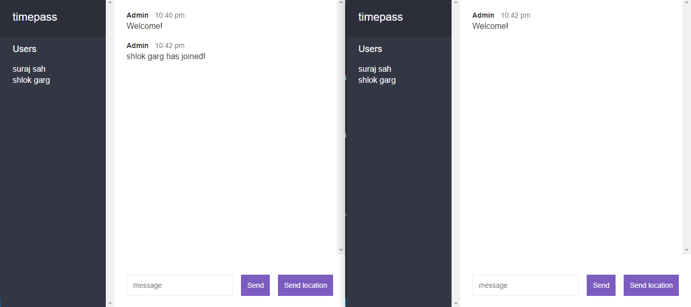
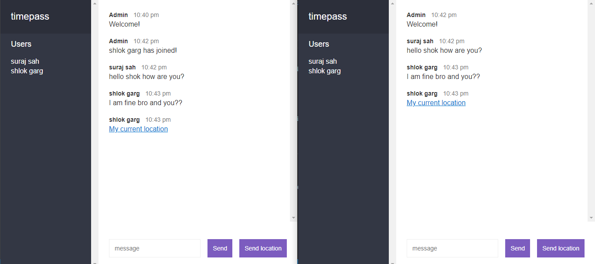

# node-v1-chat-app  

***Simple Chat-App were you can join in one room and chat with your friends.***   
***You can send your location also and its visible to everyone available in chat room***  

**Click here to visit the Web-App** 
https://shah20-node-v1-chat-app.herokuapp.com/

    

    

    

    

