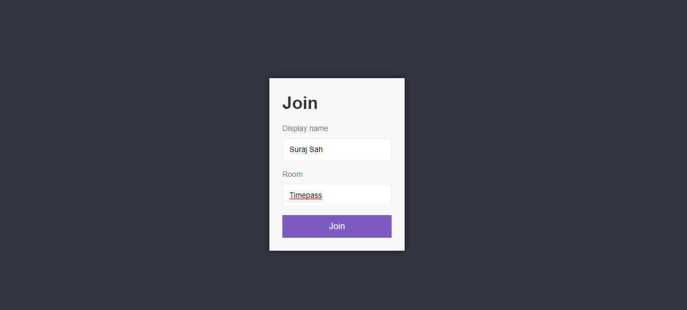
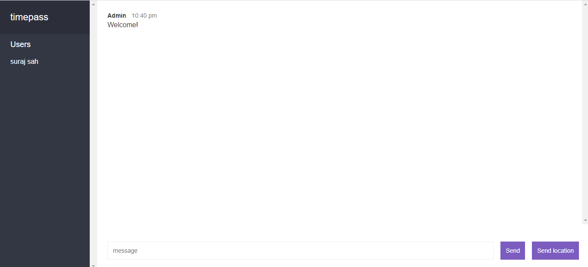

# Chat App

1. Simple Chat App where you can join any room and chat with all the people present there.
2. Also you can send your current Location to the chat room and all people heve access to it.

**Click here and start chatting** 
- [Go To The App](https://shah20-node-v1-chat-app.herokuapp.com/)

    

    

    

    

